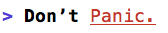

# Console.hx

Console.hx is a haxe logging utility for easy rich output in both native and browser consoles

Example:
````haxe
Console.log('<b>Don’t</b> <red><u>Panic.</u></red>');
````
This will print in your console something like:



(depending on your console color settings). This will also work in a browser console when targeting the web.

### Supported Targets

It should support all haxe targets with a console however here's a list below of which of the notable ones I've verified. Normal linux consoles are expected to work correctly, however, I suspect there will issues with the Windows CMD prompt

|           Target           |        Platform         | Tested |
| :------------------------: | :---------------------: | :----: |
|             JS             | Chrome, Firefox, Safari |   ✔    |
| C++, Neko, PHP, Python, HL |  MacOS - Terminal App   |   ✔    |
|            C++             |     Windows Console     |   ✘    |
|            C++             | Linux Common Terminals  |   ✘    |
|            C++             |         Windows         |   ✘    |

### Formatting

- HTML-like tags to enable a format flag and disable it: _\<b>_**bold**_\</b>_
- A closing tag without a tag name can be used to close the last-open format tag `</>` so _\<b>_**bold**_\</>_ will also work
- A double-closing tag like `<//>` will clear all active formatting
- Whitespace is not allowed in tags, so `<b >` would be ignored and printed as-is
- Unknown tags are skipped and will not show up in the output
- For browser targets, CSS fields and colors can be used, for example: `<{color: red; font-size: 20px}>Inline CSS</>` or `<#FF0000>Red Text</#FF0000>`. These will have no affect on native consoles


### Available Tags

|           Tag Name           |              Description              |
| :--------------------------: | :-----------------------------------: |
|      `<reset>`, `<//>`       |     Clear all previous formatting     |
|       `<bold>`, `<b>`        |            Format as bold             |
|           `<dim>`            |             Dimmed color              |
|     `<underline>`, `<u>`     |               Underline               |
|          `<blink>`           |     Blink (*Native console only*)     |
|      `<invert>`, `<!>`       | Invert colors (*Native console only*) |
|          `<hidden>`          |   Hide text (*Native console only*)   |
|          `<black>`           |           Black text color            |
|           `<red>`            |            Red text color             |
|          `<green>`           |           Green text color            |
|          `<yellow>`          |           Yellow text color           |
|           `<blue>`           |            Blue text color            |
|         `<magenta>`          |          Magenta text color           |
|           `<cyan>`           |            Cyan text color            |
|          `<white>`           |           White text color            |
|  `<light_black>`, `<gray>`   |     Light black text color / gray     |
|        `<light_red>`         |         Light red text color          |
|       `<light_green>`        |        Light green text color         |
|       `<light_yellow>`       |        Light yellow text color        |
|        `<light_blue>`        |         Light blue text color         |
|      `<light_magenta>`       |       Light magenta text color        |
|        `<light_cyan>`        |         Light cyan text color         |
|       `<light_white>`        |        Light white text color         |
|         `<bg_black>`         |         Text background black         |
|          `<bg_red>`          |          Text background red          |
|         `<bg_green>`         |         Text background green         |
|        `<bg_yellow>`         |        Text background yellow         |
|         `<bg_blue>`          |         Text background blue          |
|        `<bg_magenta>`        |        Text background magenta        |
|         `<bg_cyan>`          |         Text background cyan          |
|         `<bg_white>`         |         Text background white         |
| `<bg_light_black>`, `<gray>` |  Text background light black / gray   |
|       `<bg_light_red>`       |       Text background light red       |
|      `<bg_light_green>`      |      Text background light green      |
|     `<bg_light_yellow>`      |     Text background light yellow      |
|      `<bg_light_blue>`       |      Text background light blue       |
|     `<bg_light_magenta>`     |     Text background light magenta     |
|      `<bg_light_cyan>`       |      Text background light cyan       |
|      `<bg_light_white>`      |      Text background light white      |
